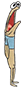

  

<h1>Funcionamiento</h1>

El funcionamiento es sencillo. El programa empieza generando el
número de clientes y cocineros dados. Se generarán tantos supervisores
como cocineros haya, para asegurar que todos estos tienen trabajo. En
caso de que un supervisor encuentre un cocinero que no está atendiendo
a nadie, este le mandará a cocinar una hamburguesa y añadirla a una
bandeja común para cuando llegue un nuevo cliente, dársela directamente y
no perder tiempo cocinando otra. 
El programa exporta un archivo de texto "estadísticas.txt" con estadísticas
sobre el número de clientes y cocineros, hamburguesas en total que se han
cocinado y una lista con la cantidad de veces que se ha servido a cada cliente.
Aparte también se añade una media de veces servidas para ver si hay algún
cliente que se queda atrás y si muere de inanición.

<h1>Clases principales</h1>
<h2> Crustáceo Crujiente</h2>

Casa de la Cangreburguer, hamburguesa estrella
de Fondo de Bikini. 
El él trabajan tanto cocineros, como supervisores, los cuales
esperan las comandas de sus queridos clientes.

<h2> Cocinero</h2>

Cocinero encargado de hacer las hamburguesas. Si está
trabajando y llega un cliente, este esperará en cola hasta
que termine lo que esté haciendo.

<h2> Cliente</h2>

Animal marino despiadado con la única misión de comer
y gastar hasta el último centavo en Cangreburgers.

<h2> Supervisor</h2>

Los mandamases. Encargados de comprobar que cada cocinero está
trabajando continuamente.

